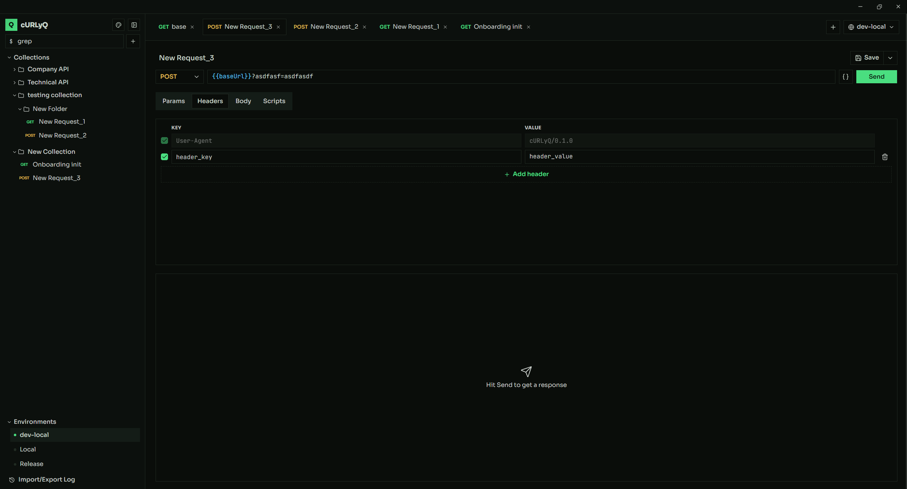
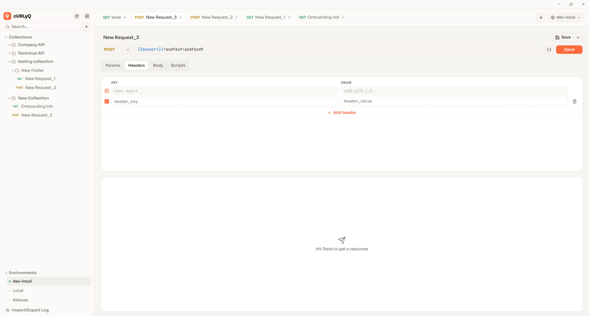

# cURLyQ

A desktop HTTP client for sending requests and inspecting responses — a Postman alternative, inspired by it. Built as a learning project for practicing Claude Code, step by step. See [`project_specs.md`](./project_specs.md) for the shipped MVP scope.

<p align="center">
  
  
</p>

## Features

- **Request builder** — method, URL with live query-param sync, headers, and a raw/JSON body (auto-sets `Content-Type: application/json`), sent via a Rust-side `reqwest` client.
- **Tabs** — multiple requests open at once, persisted across restarts (including which tab and which Params/Headers/Body sub-tab was active).
- **Environments** — `{{variable}}` substitution across URL/params/headers/body, managed from a dedicated dialog and switched from the sidebar/tab bar.
- **Collections** — Postman-style nested folders, drag-and-drop reordering and moving (including across collections), rename/delete with a cascade-delete confirmation for non-empty folders.
- **Import/Export** — environments and collections import/export as Postman v2.1 JSON, with a recent-activity log (click an entry for full error details) and toast notifications for success/failure.
- **Response viewer** — status, headers, and a pretty-printed body.
- **Pre-request / post-response scripts** — sandboxed JS scripts per request that can read/write environment variables and (pre-request) tweak headers/body before sending. See [`docs/scripting.md`](./docs/scripting.md).
- **Themes** — light, dark, and terminal (a CRT-inspired palette), switched from the sidebar and persisted across restarts. A custom titlebar replaces the native OS one so window chrome follows the theme too, not just the app content.

## Releases

Cross-platform release builds (Windows/macOS/Linux) are produced by a GitHub
Actions workflow triggered on version tags. See [`docs/releasing.md`](./docs/releasing.md)
for the process.

## Stack

- **Frontend**: TypeScript + React, in Tauri's native webview. Styled with Tailwind CSS v4 + shadcn/ui; drag-and-drop via `@dnd-kit`, toasts via `sonner`.
- **Backend**: Rust, exposed as Tauri commands (`#[tauri::command]`); performs the actual HTTP requests via `reqwest`.
- **Packaging**: Tauri (native binary, not Electron).

## Development

```sh
npm install
npm run tauri dev    # run the app with hot reload
npm run tauri build  # build a release binary
```

Other useful commands:

```sh
npm run dev      # frontend-only Vite dev server
cargo check       # type-check the Rust backend (run from src-tauri/)
cargo fmt         # format the Rust backend (run from src-tauri/)
cargo clippy      # lint the Rust backend (run from src-tauri/)
cargo test        # run Rust unit tests (run from src-tauri/)
```

`.github/workflows/ci.yml` runs `npm run build`, `cargo fmt --check`, `cargo clippy -D warnings`, and `cargo test` on every PR and push to `master` — worth running these locally before pushing.

## Recommended IDE Setup

- [VS Code](https://code.visualstudio.com/) + [Tauri](https://marketplace.visualstudio.com/items?itemName=tauri-apps.tauri-vscode) + [rust-analyzer](https://marketplace.visualstudio.com/items?itemName=rust-lang.rust-analyzer)
